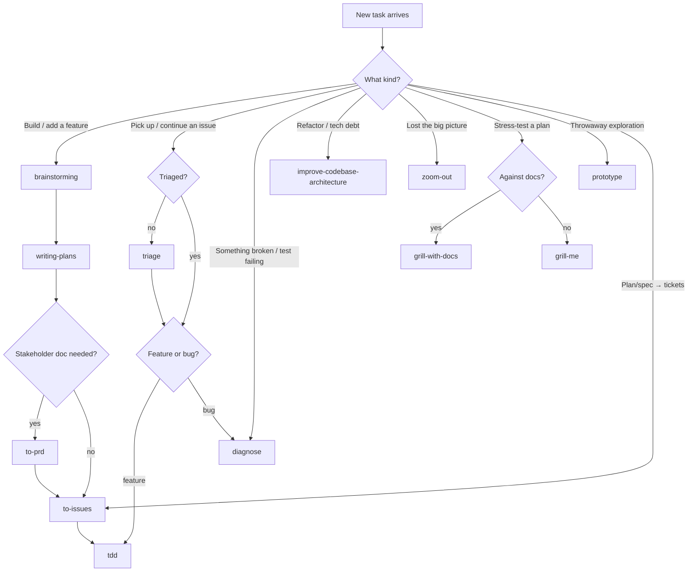

# Quay

Cross-platform CLI + TUI for sharing AI agent skills (SKILL.md) across organizations and personal hubs. Like `npm` for skills, with git-native transport.

## What It Does

- Pull individual skills from GitHub-hosted hubs into a local `.agents/skills/` folder
- Push new skills back to a hub via PR
- Browse / search / install skills via interactive TUI
- Multi-hub support (configure N remote hubs per project)
- Tool-agnostic skills: same SKILL.md works for Claude Code, Codex, Cursor, Copilot, Kimi, etc.

## Repository Layout

This is a monorepo. Minimum two packages:

```
quay/
├── AGENTS.md                  # this file — universal project instructions
├── .agents/                   # universal agent config (skills, rules, commands, personas)
│   ├── README.md
│   ├── skills/                # SKILL.md workflows
│   ├── rules/                 # modular instructions
│   ├── commands/              # slash-command definitions
│   └── agents/                # subagent personas
├── .claude/                   # Claude Code-specific only (settings, hooks)
│   ├── README.md
│   ├── settings.json
│   └── hooks/
├── docs/                      # design specs, architecture, guides
│   └── superpowers/
│       ├── specs/             # design docs (YYYY-MM-DD-<topic>-design.md)
│       └── plans/             # implementation plans (YYYY-MM-DD-plan-N-*.md)
├── apps/
│   ├── cli/                   # Rust CLI + TUI binary (Cargo workspace)
│   │   ├── Cargo.toml
│   │   └── crates/
│   │       ├── quay-core/     # domain logic (config, resolver, manager)
│   │       ├── quay-cli/      # clap commands
│   │       ├── quay-tui/      # ratatui screens
│   │       └── quay/          # binary, wires above
│   └── web/                   # Next.js + shadcn site (later phase)
│       └── (TBD after CLI MVP)
└── packages/                  # shared TS packages if web ever needs them
```

### `.agents/` vs `.claude/`

We split agent configuration into a **universal** pool and a **Claude-specific** pool. This dogfoods quay's tool-agnostic skill model.

| Concern                                    | Location              |
|--------------------------------------------|-----------------------|
| Project-wide instructions                  | `AGENTS.md` (this file) |
| Skills, rules, slash commands, subagents   | `.agents/`            |
| Claude permissions, hooks, status line     | `.claude/`            |

If a config could plausibly be reused by Codex, Cursor, Copilot, Kimi, or Gemini CLI, it lives in `.agents/`. If it only makes sense for Claude Code, it lives in `.claude/`.

Older workflows that still expect `CLAUDE.md` should symlink: `ln -s AGENTS.md CLAUDE.md` (then gitignore the symlink).

### Multi-stack rules + personas

Rules and personas are organized by stack:

| Scope        | Rules                                                                       | Personas                                                       |
|--------------|------------------------------------------------------------------------------|----------------------------------------------------------------|
| Repo-wide    | `git-policy.md`, `security.md`                                               | —                                                              |
| `apps/cli/`  | `code-style.md`, `testing.md` (path-scoped to Rust)                          | `code-reviewer`, `implementer`, `tester`                       |
| `apps/web/`  | `web-code-style.md`, `web-testing.md`, `web-accessibility.md` (path-scoped)  | `react-implementer`, `web-reviewer`, `e2e-tester`, `a11y-auditor`, `perf-auditor` |

Path-scoped rules (`paths:` frontmatter) apply only when files in their glob are touched. Repo-wide rules apply always.

### Mono → poly migration trigger

Today this is a monorepo. The plan is to split `apps/web/` into a separate repo when **either** condition is met:

1. The web app crosses ~5K LOC of non-generated TypeScript.
2. The web app needs an independent deploy cadence (first production deploy is the natural cut point).

When that happens:
- New repo: `<org>/quay-web` (or whatever name).
- Shared rules + personas extract to `<org>/agents-hub`, consumed by both repos via `quay add <org>/agents-hub@<rule>`.
- This repo (`quay`) keeps the CLI + remains the source-of-truth for Rust skills.

Until the trigger is hit, both stacks live here, with path-scoped rules + personas keeping concerns separated.

Per-directory READMEs: [`.agents/README.md`](.agents/README.md) and [`.claude/README.md`](.claude/README.md). Implementation plans live under `docs/superpowers/` (gitignored — local working notes for agents).

## Status

Plans 1–7a + 6.85 + 7b + 8 + 9 + 10 + 10c + 10d + 10e + **10f** are **implemented** (**v0.2.4**). The CLI provides:
- `init`, `remote add/list/remove` — project setup
- `remote test <name>` — live test-connection probe (registry.json fetch via git)
- `remote add ... --provider <kind>` — explicit provider override (github, githubenterprise, gitlab, bitbucket, azuredevops)
- `profile list/add/remove/use/current/show/rename` — multi-org identities
- `add`, `list`, `remove`, `info` — single-skill lifecycle
- `search`, `outdated`, `update`, `sync` — discovery and reproducibility
- `create`, `validate [--strict]`, `push [--push-mode pr|direct]`, `scan` — author + contribute path
  - `scan` discovers local skills under `.agents/skills/` in any of three formats — Frontmatter (canonical YAML), SlashCommand (`# /<name>` H1), Freestyle (any markdown) — and reports each skill's status (`local`, `installed`, `installed-modified`, `pushed-local`) by cross-referencing the lockfile and `.quay/push-log.json`.
  - `validate` is soft by default (warnings to stderr, exit 0); pass `--strict` to fail on missing frontmatter / required fields.
  - `push` accepts skills in any of the three formats. Frontmatter skills with `--bump` are re-emitted with the new version; SlashCommand / Freestyle skills are written to the hub byte-identically. Bumping a non-Frontmatter skill is rejected with a clear error.
  - `push` honors per-remote `push_mode` (Plan 9): `pr` (default — opens PR via `gh`/`glab`/`az`) or `direct` (commits and `git push` to the hub's default branch with no provider-CLI dependency). `--push-mode` overrides per invocation. Direct mode works on any git host. Branch-protection failures surface a clear hint pointing to `push_mode = pr`.
- `link`, `link check/add/remove` — multi-tool mirrors
- `tui` — interactive Dashboard / Browse / Search / Installed / Settings (Profiles / Remotes / Install tabs) + Create/Push (Screen 5, hybrid TUI form + `$EDITOR`) + first-run onboarding gate + profile switcher modal
  - Settings → Remotes `t` keybind probes connection live; add/edit modal has provider picker
  - Create/Push Done panel `[o]` opens PR URL in system browser (xdg-open / open / cmd /c start)
  - Bracketed paste enabled (Plan 6.85): Ctrl+V / Shift+Insert / middle-click pastes into any focused text input across Onboarding, Settings (Profiles/Remotes/Install) modals, and Create/Push form. CR/LF stripped from paste.
  - Forms migrated to `ratatui-form` 0.1.1 (Plan 6.85): Onboarding (Step 1 + Step 2), Settings → Profiles modal, Settings → Remotes modal (provider picker is a Select), and Create/Push frontmatter form share a unified dark `FormStyle` with built-in Tab/Shift+Tab navigation, `Required`/`Pattern` validation, and per-field error reporting on submit.
  - Dashboard "Local skills" panel (Plan 8): scans `.agents/skills/` on screen entry, lists every discovered skill with a status badge (`◌ local`, `◉ installed vX`, `⚠ modified vX`, `↑ pushed-local`). Keybinds: `[r]` rescan, `[j]/[k]` navigate, `[u]` push selected.
  - Onboarding gate fixed (Plan 8): now driven by `profiles.is_empty()` alone — users who skipped onboarding once (writing `meta.onboarded = true` with no profiles) get onboarding back on next launch instead of being stuck on a barren Dashboard.
  - Settings → Remotes modal exposes `Push mode` Select (Plan 9) alongside the provider picker. Create/Push Done panel shows `Direct push to <branch> at <sha>` when no PR was opened. Dashboard's Local skills badge differentiates `↑ pushed-direct` from `↑ pushed-local` based on whether a PR URL was recorded.
  - `quay remote add ... --push-mode <pr|direct>` (Plan 9) sets the mode at remote-creation time without TOML editing.
  - Global keybindings (`g`-chord, single-letter screen jumps, `q`, `p`) bypass the focused screen when a text input is focused (Onboarding form, Create/Push form, Settings add/edit modal). Prevents `evgenii` and similar identifiers from being mangled by the chord prefix. Esc still cancels forms as before.

All commands honor `--profile`, `--remote`, and `--json`.

Test status: ~319 tests passing (4 ignored env-var/editor/network tests) in `apps/cli/`, 0 clippy warnings, release build succeeds. (Note: pre-existing integration test failures in `cmd_add`, `cmd_outdated`, `cmd_push`, `cmd_remote`, `cmd_search`, `cmd_update` when the user has a real `~/.config/quay/config.toml` with conflicting remote names — test isolation gap, not a Plan 10 regression.)

Plan 10 ships filesystem-first model: drops `skills.lock.json`, `quay sync`, `quay create`. TUI restructured (Local + Remote + Search). Multi-mirror scan (`MirrorRoot`: `.agents/`, `.claude/`, `.codex/`, `.cursor/`). **v0.2.0** — breaking; lockfile detection prints removal hint. `quay scan` adds mirrors + drift columns. `quay list` reads scanner output.

Plan 10c ships bulk select: TUI `[Space]` toggle on Local/Remote screens; bulk push/pull/delete with `[u]/[U]/[a]/[A]/[d]/[D]` operate over selected rows when non-empty (single-skill flow preserved when picks empty). CLI gains `quay push|add|update -i` interactive `dialoguer::MultiSelect` checkbox prompt; non-TTY fallback exits with a clear error. **v0.2.1.**

Plan 10d ships profile creation UX: `quay profile add -i` interactive wizard (name → email → remote loop → activate, via `dialoguer`); `quay profile add <name> --from-toml <path|->` TOML ingestion from file or stdin; `--remote` is now repeatable with per-remote `--provider`, `--push-mode`, `--default` flags; `ProfileDraft` + `write_to_user_config` is the single canonical persistence path shared by wizard, TOML-ingest, and TUI Onboarding. **v0.2.2.**

Plan 10e adds `quay remove -i` + `--everywhere`. Bare `add`/`push`/`update`/`remove` in a TTY auto-open the multi-select picker. Non-TTY (script/pipe/CI) preserves previous behaviour. `quay update --all` is the explicit escape hatch on TTY. **v0.2.3.**

Plan 10f adds the per-collision prompt to `quay add -i` and TUI Remote `[a]` bulk pull. Three-way batch dialog: **Update all** (overwrite from remote) / **Skip all** (only install new ones) / **Prompt per skill** (per-collision Update/Skip). Pure `build_plan` / `build_plan_with_prompt` functions in `quay-core::add_plan` handle the decision logic. Single-skill `quay add foo` still errors on collision (use `--force`). TUI `[A]` force-pull unchanged. **v0.2.4.**

Plan 7b shipped (v0.1.1+ on GitHub Releases, Homebrew tap auto-published). Open follow-ups: Plan 7c (crates.io publish + crate rename), test isolation for `cmd_add.rs` (override `XDG_CONFIG_HOME` / `--user-config` per test), `quay doctor` audit + auto-fix.

**Releases:** <https://github.com/evgeniiPerov/quay/releases> — six target triples (macOS x64+arm64, Linux x64+arm64+musl, Windows x64) + shell + PowerShell + Homebrew installers.

### Breaking changes (Plan 7a)
- `QUAY_PROVIDER` environment variable is no longer honored. Set `provider = "<kind>"` in the remote's TOML entry, or run `quay remote edit <name> --provider <kind>` (TUI: Settings → Remotes → `e`). Valid kinds: `github`, `githubenterprise`, `gitlab`, `bitbucket`, `azuredevops`.

## Decisions Locked

| Area | Choice |
|------|--------|
| Name | `quay` (binary, repo, crate) |
| Language | Rust |
| TUI lib | `ratatui` |
| CLI lib | `clap` (derive) |
| Distribution | GitHub Releases + Homebrew tap (via `cargo-dist`) |
| Hub model | Generic — any GitHub repo can be a hub. N hubs supported per project. |
| Transport | Git-native (CLI shells `git clone` / `pull` / `push`) |
| Auth | Whatever the user's git config provides (SSH keys, credential helper, gh CLI) |
| Skill format | `SKILL.md` with YAML frontmatter (`name`, `description`, `version`, `tags`, `author`) |
| Versioning | Per-skill semver in frontmatter; git history is the source of truth (no lockfile as of v0.2.0) |
| MVP scope | Full TUI as primary UX (~6 weeks) |
| Web | Phase 2, separate package, Next.js + shadcn |

## Working in This Repo

- Use `pnpm` for any JS/TS code (web app, future tooling)
- Use `cargo` for Rust CLI
- Code style: see per-package configs (Cargo `clippy` for Rust, Biome for TS)
- Commits: assistants may run `git commit` / `git push` when the user explicitly asks; otherwise leave git to the user
- Commit messages: do NOT add a `Co-Authored-By` trailer (or any assistant attribution)

## Agent skills

This repo uses the [mattpocock/skills](https://github.com/mattpocock/skills) engineering toolkit (installed under `.agents/skills/`). The three files below tell those skills how *this* repo works — read the relevant one before a skill needs it.

### Issue tracker

Issues + PRDs live as **GitHub issues** on `evgeniiPerov/quay`, driven by the `gh` CLI. See [`docs/agents/issue-tracker.md`](docs/agents/issue-tracker.md).

### Triage labels

Five canonical roles (`needs-triage`, `needs-info`, `ready-for-agent`, `ready-for-human`, `wontfix`) mapped 1:1 to GitHub labels — create them once before first triage. See [`docs/agents/triage-labels.md`](docs/agents/triage-labels.md).

### Domain docs

**Single-context.** `CONTEXT.md` / `docs/adr/` created lazily by `/grill-with-docs`; until then follow vocabulary in this file + `docs/superpowers/`. See [`docs/agents/domain.md`](docs/agents/domain.md).

### How to start a job — skill routing

Pick the entry skill by the *kind* of work. Process skills run **before** implementation. `brainstorming` runs **before** entering plan mode.



Quick lookup:

| Job | Start with | Then |
|-----|-----------|------|
| Build a new feature | `brainstorming` | → `writing-plans` → `to-issues` → `tdd` |
| Continue an open issue | `triage` (if unsorted) | → `tdd` (feature) / `diagnose` (bug) |
| Bug, crash, failing test | `diagnose` | systematic repro → fix → regression test |
| Refactor / reduce tech debt | `improve-codebase-architecture` | informed by `docs/agents/domain.md` |
| Re-orient on the whole repo | `zoom-out` | — |
| Pressure-test a design | `grill-me` / `grill-with-docs` | resolve every branch first |
| Try an idea cheaply | `prototype` | throwaway, then real plan |
| Turn a plan into tickets | `to-issues` | vertical tracer-bullet slices |
| Capture discussion as a PRD | `to-prd` | publishes a GitHub issue |

## Brainstorming / Design Workflow

The `brainstorming` skill drives design iteration. Capture outputs here:
1. Discussion happens in the working session (use the `brainstorming` skill)
2. Decisions captured here in AGENTS.md
3. Final spec written to `docs/superpowers/specs/YYYY-MM-DD-<topic>-design.md`
4. Implementation plans written to `docs/superpowers/plans/` (use `writing-plans`)
5. Code lives under `apps/`

## See Also

- `docs/superpowers/specs/` — design documents
- Origin context: this project was extracted from a brainstorming session in the `cms-craft` workspace and lives independently from that point forward.
