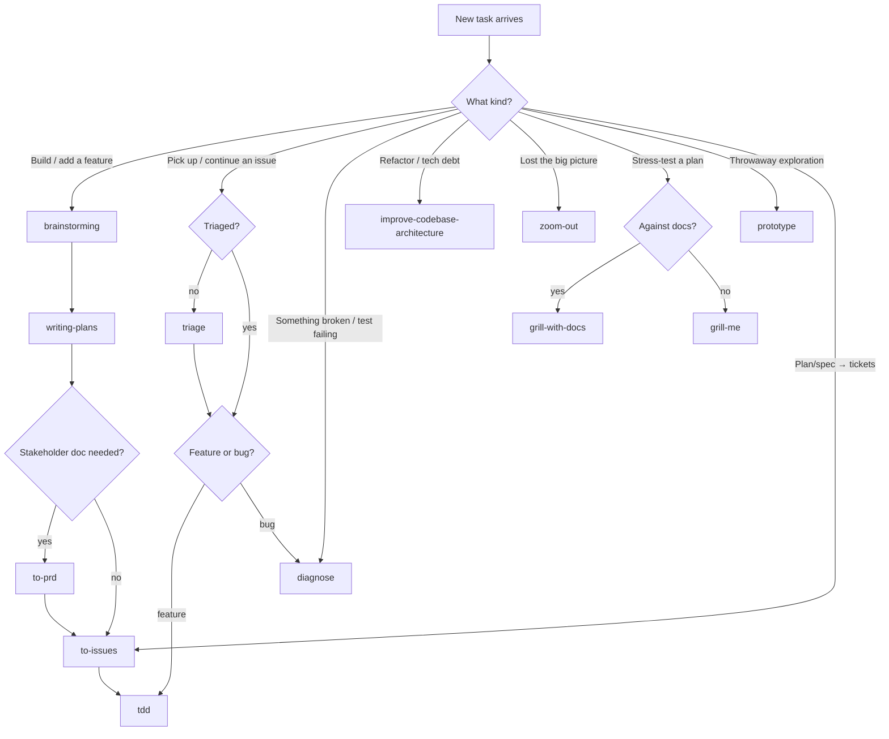

# Quay

Cross-platform CLI for sharing AI agent skills (SKILL.md) across organizations and personal hubs. Like `npm` for skills, with git-native transport.

## What It Does

- Pull individual skills from GitHub-hosted hubs into a local `.agents/skills/` folder
- Push new skills back to a hub via PR
- Browse / search / install skills from the CLI
- Multi-hub support (configure N remote hubs per project)
- Tool-agnostic skills: same SKILL.md works for Claude Code, Codex, Cursor, Copilot, Kimi, etc.

## Repository Layout

This is a monorepo. Minimum two packages:

```
quay/
├── AGENTS.md                  # this file — universal project instructions
├── .agents/                   # universal agent config (skills, rules, commands, personas)
│   ├── README.md
│   ├── skills/                # SKILL.md workflows
│   ├── rules/                 # modular instructions
│   ├── commands/              # slash-command definitions
│   └── agents/                # subagent personas
├── .claude/                   # Claude Code-specific only (settings, hooks)
│   ├── README.md
│   ├── settings.json
│   └── hooks/
├── docs/                      # design specs, architecture, guides
│   └── superpowers/
│       ├── specs/             # design docs (YYYY-MM-DD-<topic>-design.md)
│       └── plans/             # implementation plans (YYYY-MM-DD-plan-N-*.md)
├── apps/
│   ├── cli/                   # Rust CLI binary (Cargo workspace)
│   │   ├── Cargo.toml
│   │   └── crates/
│   │       ├── quay-core/     # domain logic (config, resolver, manager)
│   │       ├── quay-cli/      # clap commands
│   │       ├── quay-mcp/      # MCP server (`quay mcp`)
│   │       └── quay/          # binary, wires above
│   └── web/                   # Next.js + shadcn site (later phase)
│       └── (TBD after CLI MVP)
└── packages/                  # shared TS packages if web ever needs them
```

### `.agents/` vs `.claude/`

We split agent configuration into a **universal** pool and a **Claude-specific** pool. This dogfoods quay's tool-agnostic skill model.

| Concern                                    | Location              |
|--------------------------------------------|-----------------------|
| Project-wide instructions                  | `AGENTS.md` (this file) |
| Skills, rules, slash commands, subagents   | `.agents/`            |
| Claude permissions, hooks, status line     | `.claude/`            |

If a config could plausibly be reused by Codex, Cursor, Copilot, Kimi, or Gemini CLI, it lives in `.agents/`. If it only makes sense for Claude Code, it lives in `.claude/`.

Older workflows that still expect `CLAUDE.md` should symlink: `ln -s AGENTS.md CLAUDE.md` (then gitignore the symlink).

### Multi-stack rules + personas

Rules and personas are organized by stack:

| Scope        | Rules                                                                       | Personas                                                       |
|--------------|------------------------------------------------------------------------------|----------------------------------------------------------------|
| Repo-wide    | `git-policy.md`, `security.md`                                               | —                                                              |
| `apps/cli/`  | `code-style.md`, `testing.md` (path-scoped to Rust)                          | `code-reviewer`, `implementer`, `tester`                       |
| `apps/web/`  | `web-code-style.md`, `web-testing.md`, `web-accessibility.md` (path-scoped)  | `react-implementer`, `web-reviewer`, `e2e-tester`, `a11y-auditor`, `perf-auditor` |

Path-scoped rules (`paths:` frontmatter) apply only when files in their glob are touched. Repo-wide rules apply always.

### Mono → poly migration trigger

Today this is a monorepo. The plan is to split `apps/web/` into a separate repo when **either** condition is met:

1. The web app crosses ~5K LOC of non-generated TypeScript.
2. The web app needs an independent deploy cadence (first production deploy is the natural cut point).

When that happens:
- New repo: `<org>/quay-web` (or whatever name).
- Shared rules + personas extract to `<org>/agents-hub`, consumed by both repos via `quay add <org>/agents-hub@<rule>`.
- This repo (`quay`) keeps the CLI + remains the source-of-truth for Rust skills.

Until the trigger is hit, both stacks live here, with path-scoped rules + personas keeping concerns separated.

Per-directory READMEs: [`.agents/README.md`](.agents/README.md) and [`.claude/README.md`](.claude/README.md). Implementation plans live under `docs/superpowers/` (gitignored — local working notes for agents).

## Status

Current version: see `apps/cli/Cargo.toml`; per-release history in [`CHANGELOG.md`](CHANGELOG.md). Commands (source of truth: `apps/cli/crates/quay-cli/src/args.rs`):

- Setup: `init`, `remote add/list/remove/test/edit`, `profile …` (multi-org identities)
- Skill lifecycle: `add` (alias `ls`), `list`, `remove`, `info`, `search`, `diff`, `outdated`, `update`
- Authoring: `scan`, `validate [--strict]`, `push [--push-mode pr|direct]`, `rebuild-registry`
- Mirrors / interop: `link`, `agents list|link` (~80 coding agents), `lock` (vercel-compatible `skills-lock.json`)
- `mcp` — MCP server over stdio

All commands honor `--profile`, `--project`, `--user-config`, and `--json`.

Open follow-ups live in GitHub issues (`gh issue list`).

## Decisions Locked

| Area | Choice |
|------|--------|
| Name | `quay` (binary, repo, crate) |
| Language | Rust |
| CLI lib | `clap` (derive) |
| Distribution | GitHub Releases + Homebrew tap (via `cargo-dist`) |
| Hub model | Generic — any GitHub repo can be a hub. N hubs supported per project. |
| Transport | Git-native (CLI shells `git clone` / `pull` / `push`) |
| Auth | Whatever the user's git config provides (SSH keys, credential helper, gh CLI) |
| Skill format | `SKILL.md` with YAML frontmatter (`name`, `description`, `version`, `tags`, `author`) |
| Versioning | Per-skill semver in frontmatter; git history is the source of truth; `skills-lock.json` only for vercel interop (`quay lock`) |
| Web | Phase 2, separate package, Next.js + shadcn |

## Working in This Repo

- Use `pnpm` for any JS/TS code (web app, future tooling)
- Use `cargo` for Rust CLI
- Code style: see per-package configs (Cargo `clippy` for Rust, Biome for TS)
- Commits: assistants may run `git commit` / `git push` when the user explicitly asks; otherwise leave git to the user
- Commit messages: do NOT add a `Co-Authored-By` trailer (or any assistant attribution)

## Agent skills

This repo uses the [mattpocock/skills](https://github.com/mattpocock/skills) engineering toolkit (installed under `.agents/skills/`). The three files below tell those skills how *this* repo works — read the relevant one before a skill needs it.

### Issue tracker

Issues + PRDs live as **GitHub issues** on `evgeniiPerov/quay`, driven by the `gh` CLI. See [`docs/agents/issue-tracker.md`](docs/agents/issue-tracker.md).

### Triage labels

Five canonical roles (`needs-triage`, `needs-info`, `ready-for-agent`, `ready-for-human`, `wontfix`) mapped 1:1 to GitHub labels — create them once before first triage. See [`docs/agents/triage-labels.md`](docs/agents/triage-labels.md).

### Domain docs

**Single-context.** `CONTEXT.md` / `docs/adr/` created lazily by `/grill-with-docs`; until then follow vocabulary in this file + `docs/superpowers/`. See [`docs/agents/domain.md`](docs/agents/domain.md).

### How to start a job — skill routing

Pick the entry skill by the *kind* of work. Process skills run **before** implementation. `brainstorming` runs **before** entering plan mode.


```mermaid
flowchart TD
    A[New task arrives] --> B{What kind?}

    B -->|Build / add a feature| C[brainstorming]
    C --> C2[writing-plans]
    C2 --> C3{Stakeholder doc needed?}
    C3 -->|yes| C4[to-prd] --> D[to-issues]
    C3 -->|no| D
    D --> E[tdd]

    B -->|Pick up / continue an issue| F{Triaged?}
    F -->|no| G[triage] --> H
    F -->|yes| H{Feature or bug?}
    H -->|feature| E
    H -->|bug| I

    B -->|Something broken / test failing| I[diagnose]

    B -->|Refactor / tech debt| J[improve-codebase-architecture]
    B -->|Lost the big picture| K[zoom-out]

    B -->|Stress-test a plan| L{Against docs?}
    L -->|yes| L1[grill-with-docs]
    L -->|no| L2[grill-me]

    B -->|Throwaway exploration| M[prototype]
    B -->|Plan/spec → tickets| D
```

Quick lookup:

| Job | Start with | Then |
|-----|-----------|------|
| Build a new feature | `brainstorming` | → `writing-plans` → `to-issues` → `tdd` |
| Continue an open issue | `triage` (if unsorted) | → `tdd` (feature) / `diagnose` (bug) |
| Bug, crash, failing test | `diagnose` | systematic repro → fix → regression test |
| Refactor / reduce tech debt | `improve-codebase-architecture` | informed by `docs/agents/domain.md` |
| Re-orient on the whole repo | `zoom-out` | — |
| Pressure-test a design | `grill-me` / `grill-with-docs` | resolve every branch first |
| Try an idea cheaply | `prototype` | throwaway, then real plan |
| Turn a plan into tickets | `to-issues` | vertical tracer-bullet slices |
| Capture discussion as a PRD | `to-prd` | publishes a GitHub issue |

## Brainstorming / Design Workflow

The `brainstorming` skill drives design iteration. Capture outputs here:
1. Discussion happens in the working session (use the `brainstorming` skill)
2. Decisions captured here in AGENTS.md
3. Final spec written to `docs/superpowers/specs/YYYY-MM-DD-<topic>-design.md`
4. Implementation plans written to `docs/superpowers/plans/` (use `writing-plans`)
5. Code lives under `apps/`

## See Also

- `docs/superpowers/specs/` — design documents
- Origin context: this project was extracted from a brainstorming session in the `cms-craft` workspace and lives independently from that point forward.
