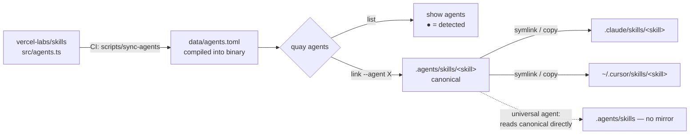

# `quay agents`

Mirror your installed skills into any supported coding agent's skill directory,
using quay's built-in **agent registry** — no per-agent config to hand-write.

The registry (`~80` agents: Claude Code, Codex, Cursor, Gemini CLI, …) is
generated from [`vercel-labs/skills`](https://github.com/vercel-labs/skills) and
compiled into the binary. It tracks upstream automatically via CI; there is **no
Node dependency at runtime**.

## Usage

```text
quay agents list
quay agents link [--agent <id>]... [--global] [--force]
```

## How it works

One canonical copy of each skill lives under `.agents/skills/`. Every targeted
agent gets a mirror (symlink, or copy where symlinks aren't available) pointing
back at it — a single source of truth.



## `quay agents list`

Lists every agent in the registry. A `●` marks agents detected on this machine
(their config directory exists).

## `quay agents link`

- `--agent <id>` (`-a`) — target a specific agent (repeatable). Omit to target
  every **detected** agent.
- `--global` (`-g`) — install into the user-level directory (e.g.
  `~/.claude/skills`) instead of the project.
- `--force` — replace an existing entry that conflicts with quay's layout.

For **project** scope, the created mirrors are recorded under `[install].mirrors`
in `.quay/config.toml` (when the project is initialized), so [`quay link`](link.md)
and `quay link check` keep them in sync afterwards. Global mirrors are
machine-specific and are never persisted.

Agents whose directory *is* the canonical `.agents/skills` (Codex, Cursor,
Gemini CLI, …) read it directly, so no mirror is created for them.

> **Note:** `eve` uses a `package.json`-based detection that can't be expressed
> as a path check, so it is never auto-detected — target it explicitly with
> `--agent eve`.
